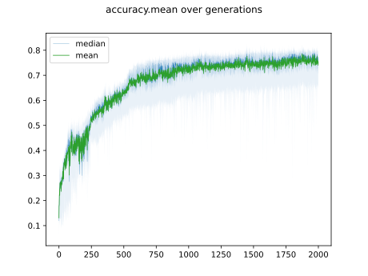

Tasks
======

This document describes the implemented tasks.

Classification Tasks
--------------------

Iris
.....

MNIST
......

   Convergence on MNIST

Recurrent Tasks
---------------

Recurrent tasks are derived from :class:`wann_genetic.tasks.base.RecurrentTask`.

.. _echo_task:

Echo Task
..........

.. _adding_task:

Adding Task
............

.. _copy_task:

Copy Task
...........

Copy task as described in :cite:`arjovsky_uni`.

The alphabet consists of 10 symbols ( :math:`\Sigma = \{ 0,...,7, e, d \}`).
Eight of those represent the available categories (:math:`\{0,..,7\}`) that
are supposed to be reproduced.
:math:`e` symbolizes an empty space, and :math:`d` is the delimiter.
Each sequence is (:math:`T+20`) elements long:
10 elements for the input,
:math:`T` elements memorization phase (the last element in that phase is :math:`d`),
and 10 empty elements during which the network will need to reproduce the input
sequence.

E.g.:

.. highlight:: none

::

  input:           6976018327eee ... eeedeeeeeeeeee
  expected output: eeeeeeeeeeeee ... eeee6976018327
                   |  (in)   | (waiting) |  (out)  |

Name Orign Task
.................

References
-----------

.. bibliography:: references.bib
