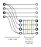

Torch Implementation of WANNs
=============================

Feed-Forward Neural Networks
----------------------------

:class:`rewann.individual.torch_network.ConcatLayer` implements the basic building block of FF-WANNs: The input is fed to a multi activation block vis a linear layer (instead of using the bias of the linear layer, a bias node is used just like in the :doc:`numpy_network` - this makes the conversion from the genes easier). In the current implementation each existing activation function is calculated once on each node and not selected functions are removed via a mask. Finally, the output of the activation block is concatenated to the original input.

   Diagram of :class:`rewann.individual.torch_network.ConcatLayer`

.. note::

  While traversing the layers, the activation vector gets bigger and bigger. In the numpy implementation, the activation vector is fully sized from the beginning.

  Limiting the size the activation vector needs to take on is only possible if one of the following conditions is met:

    1. The maximum number of nodes a network can is restricted
    2. The number of nodes a layer can hold (not so problematic) as well as the number of layers an edge can cross/skip is restricted (keep in mind that a node might have a lower possible layer and an upper possible layer - if we do the topological sorting starting at the output layer).
